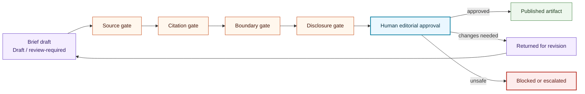

# Editorial Review Flow

## Purpose

This graph shows the editorial gates required before AI-assisted research output can be published or linked as proof.

## Mermaid Diagram

## Interpretation Notes

- Editorial approval is a human decision.
- AI output remains draft material until review is complete.
- Boundary and disclosure checks happen before publication.

## Boundary Notes

- Unsupported claims, private notes, private prompts, private model outputs, and sensitive data are blocked or removed before approval.
- Publication status must not be claimed until a public artifact exists.

## Follow-Up Actions

- Keep the editorial review template aligned with this flow.
- Add claim-evidence fields before using research briefs as portfolio proof.
