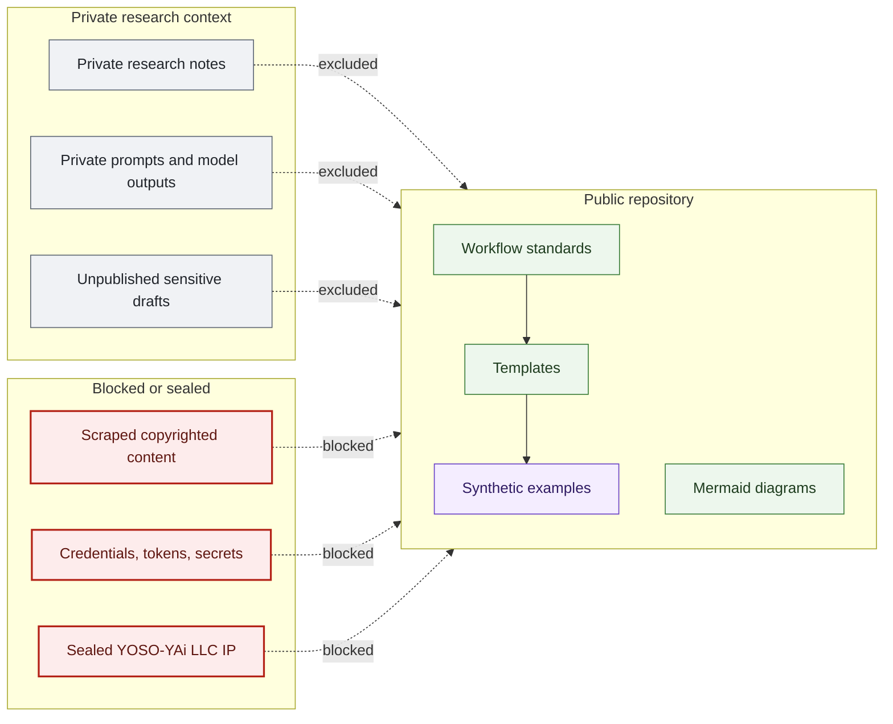

# Public Private Boundary Map

## Purpose

This graph shows what belongs in the public research workflow repo and what must remain private or sealed.

## Mermaid Diagram

## Interpretation Notes

- Public workflow artifacts are reusable process documents.
- Private research details and prompts do not belong in the public repo.
- Scraped copyrighted content is blocked.

## Boundary Notes

- Donor data, student data, volunteer private data, customer data, private Foundation operations, exact sensitive infrastructure locations, private training corpora, secrets, tokens, and sealed YOSO-YAi LLC IP are excluded.
- Synthetic examples must not be converted into implied real research outcomes.

## Follow-Up Actions

- Review every new example against this boundary map.
- Add validator terms if a new boundary category becomes relevant.
