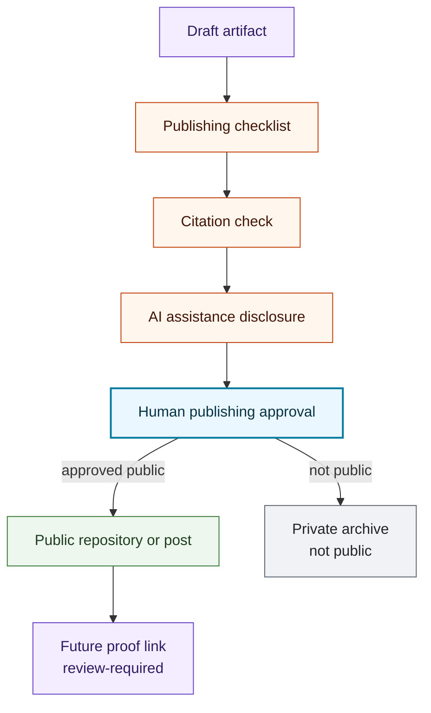

# Publishing Pipeline Map

## Purpose

This graph shows the public-safe publishing pipeline for AI-assisted research artifacts.

## Mermaid Diagram

## Interpretation Notes

- The publishing checklist runs before approval.
- Public proof linking remains review-required even after publication.
- Private archive material is not represented in public detail.

## Boundary Notes

- Publication cannot include private Foundation operations, donor data, student data, volunteer data, customer data, private training corpora, secrets, sensitive infrastructure details, or sealed IP.
- This pipeline does not automate posting or account updates.

## Follow-Up Actions

- Add publication records only when public artifacts exist.
- Keep monetization references draft/review-required until Alexandra review.
