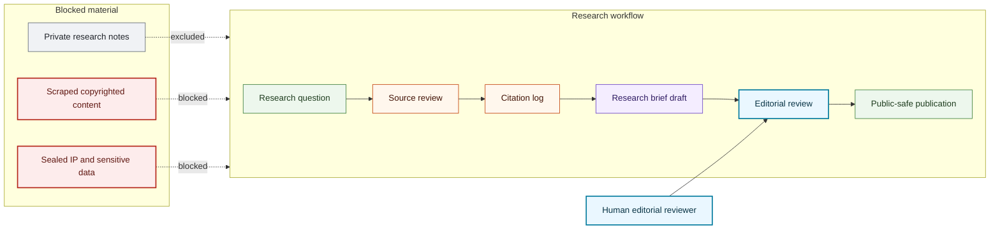

# Research Workflow Map

## Purpose

This graph shows the supervised AI-assisted research workflow from question intake through publication review.

## Mermaid Diagram

## Interpretation Notes

- AI assistance may support draft preparation, source organization, and citation formatting.
- Human editorial review controls publication.
- Source review and citation logs are required before factual claims are reused.

## Boundary Notes

- Private research notes, scraped copyrighted content, private Foundation operations, donor data, student data, customer data, and sealed YOSO-YAi LLC IP are excluded.
- Publication is allowed only after review and public-safe boundary checks.

## Follow-Up Actions

- Add workflow variants only when their source and editorial gates are documented.
- Keep disclosure templates synchronized with the workflow.
