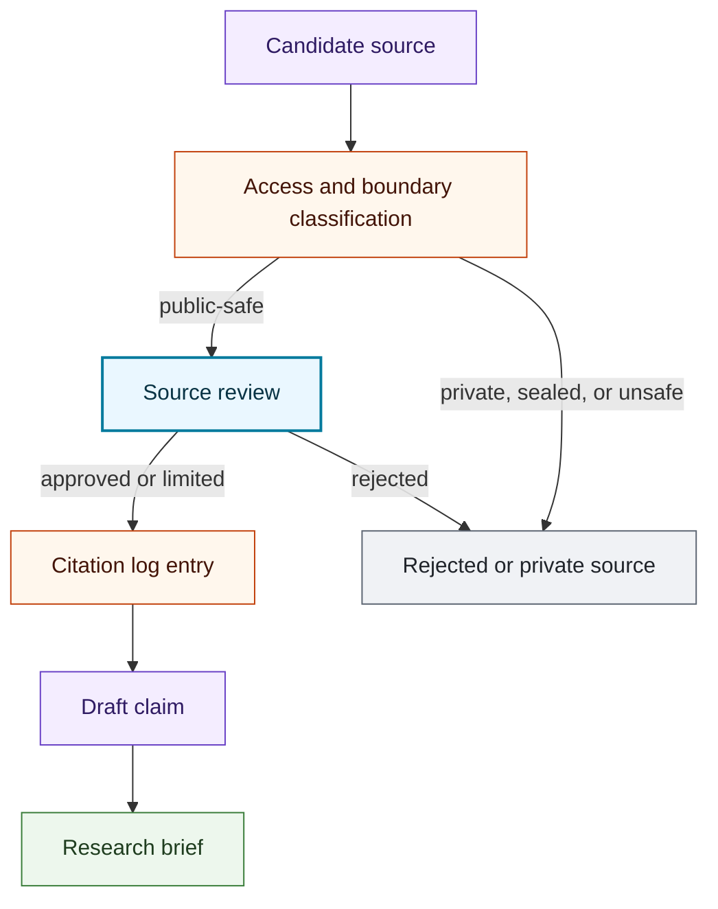

# Source To Brief Flow

## Purpose

This graph shows how reviewed sources become citation-backed research brief claims.

## Mermaid Diagram

## Interpretation Notes

- Candidate sources do not support claims until reviewed.
- Rejected, private, sealed, or unsafe sources do not enter public research briefs.
- Citation log entries connect claims to reviewed sources.

## Boundary Notes

- Paywalled or copyrighted content may be cited when appropriate, but copied text is not stored here.
- Private or sealed sources are excluded from public examples and public briefs.

## Follow-Up Actions

- Add citation examples only when source metadata is public-safe.
- Review quote handling before adding any excerpt pattern.
